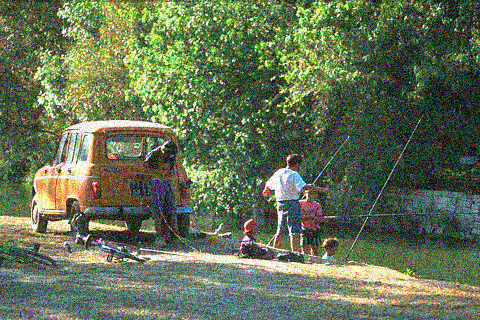
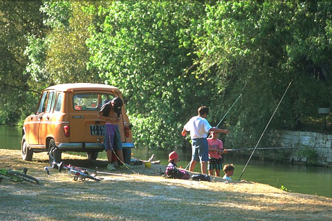
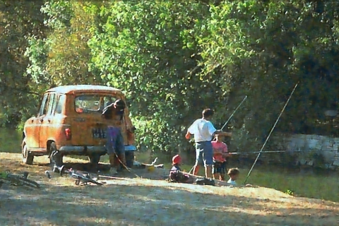

# Image Regression Model by UNet

## Train example
```
python3 "/content/drive/My Drive/Colab Notebooks/regression/train.py" \
--data_dir "/content/drive/My Drive/Colab Notebooks/regression/datasets/BSR/BSDS500/data/images" \
--ckpt_dir "/content/drive/My Drive/Colab Notebooks/regression/checkpoints" \
--log_dir "/content/drive/My Drive/Colab Notebooks/regression/log" \
--result_dir "/content/drive/My Drive/Colab Notebooks/regression/result" \
--task "denoising" \
--opts "random" 30.0

```

#### ** input image



#### ** label image



#### ** output image


